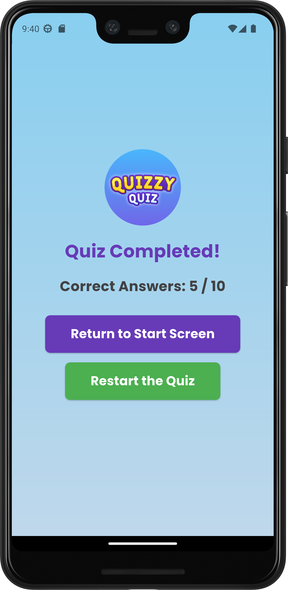

# Quizzy 🧠🎉  

Quizzy is a fun and interactive quiz application that offers multiple categories to challenge and expand your knowledge. Whether you're into Technology, Science, Music, or Sports, Quizzy has something for everyone!  

## Features ✨  
- **Category-Based Quizzes**: Choose from categories like Technology, Science, History, Music, Art, and Sports.  
- **Vibrant UI**: Beautiful and user-friendly design with category icons and gradient themes.  
- **Real-Time Scoring**: Get instant feedback on your answers and track your performance.  
- **Seamless Navigation**: Intuitive navigation for a smooth user experience.  

## Screenshots 📸  
<div>
    

   

    
 
   
</div>

## Technologies Used 🛠️
- **Flutter** for building the mobile app.
- **Dart** programming language.
- **Google Fonts** for styling.
- **Provider** for state management.

## Project Structure 📁

```graphql
Quizzy/
│
├── android/
├── ios/
├── lib/
│   ├── art_quiz_page.dart
│   ├── history_quiz_page.dart
│   ├── music_quiz_page.dart
│   ├── science_quiz_page.dart
│   ├── sport_quiz_page.dart
│   ├── technology_quiz_page.dart
│   ├── home_screen.dart
│   ├── result_page.dart
│   ├── quiz_data.dart
│   └── main.dart
├── test/
│   └── quizzy_test.dart
├── pubspec.yaml
├── README.md
└── LICENSE
```


## Installation 🚀  
Follow these steps to run the app locally:  

1. Clone the repository:  
   ```bash
   git clone https://github.com/DorukhanBekdur/quizzy.git
   
2. Navigate to the project directory:
   ```bash
   cd quizzy
   
3. Install dependencies:
   ```bash
   flutter pub get

4. Run the app:
   ```bash
   flutter run

## Contact 📬

If you have any questions, suggestions, or want to collaborate, feel free to contact me:

- **Email**: [dorukhanbekdur@gmail.com](mailto:dorukhanbekdur@gmail.com)
- **GitHub**: [https://github.com/DorukhanBekdur](https://github.com/DorukhanBekdur)
- **LinkedIn**: [https://linkedin.com/in/dorukhanbekdur](https://linkedin.com/in/dorukhanbekdur)

I'm excited to hear your feedback and ideas! 🌟

## Copyright ©️

Copyright © 2025 Dorukhan Bekdur

All rights reserved. This software and its associated documentation files (the "Software") shall not be used, copied, modified, merged, published, distributed, sublicensed, and/or sold, except with the explicit permission of the copyright holder.

